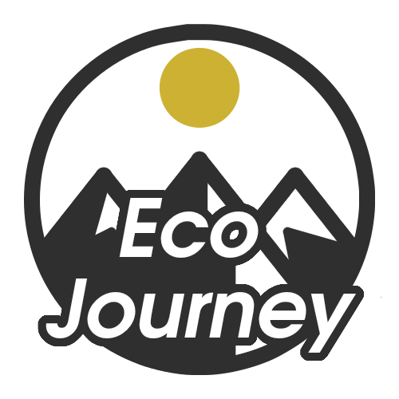

<!--  -->

Eco Journey is a collaborative project by Christian Bonnalie, 
Jarvis Kampe, and Alvaro Valdez-Duran from the University of Washington Tacoma, 
developed as part of the Database System Design course. 
 
We have aimed to create a platform that curates travel itineraries 
with an emphasis on raising awareness of potential ecological impact. 
Developed with JetBrains WebStorm v2024.1.5.

The project is divided into two main directories: client and server. 
The client directory contains the React application, 
while the server directory contains the Express server.

To run the application, navigate to the root directory and run the following command:
npm start.
 
Alternatively, navigate to the client and server directories
and run 'npm start' as separate commands.
 
The application will be available at http://localhost:3000.

